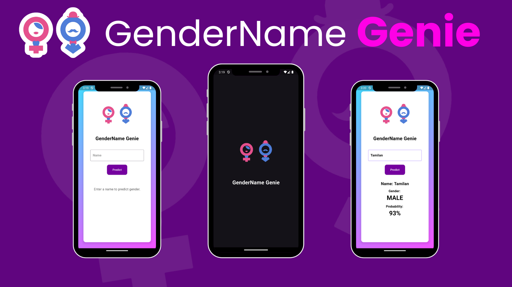

# Gender-To-Name Prediction App (GenderName Genie)

The GenderName Genie is a mobile application designed to predict the gender of a person based on their name. This app is developed based on Flutter framework, and BLoC state management.

## Project Overview

The Gender Predictor app uses the Genderize.io API to predict the gender of a given name. The app provides a user-friendly interface where users can enter a name, and the application will predict the gender along with the probability. It features a splash screen with an animated logo and a main screen with a gradient background, responsive design, and modern UI elements.

### Key Features:
- **Splash Screen**: Animated splash screen with fading logo and text.
- **Gradient Background**: Modern gradient background for a vibrant look.
- **User Input**: Text field for entering names and a button to trigger prediction.
- **Gender Prediction**: Displays predicted gender and probability based on the entered name.
- **Error Handling**: Displays appropriate error messages if the name is invalid or not found.
- **Responsive Design**: Adapts to different screen sizes and orientations.
- **Animated UI**: Smooth animations for the splash screen and UI elements.

## Tech Stack

- **Frontend Framework**: Flutter
- **State Management**: flutter_bloc
- **UI Design**: Modern and Minimalist
- **Design Pattern**: Observer Pattern

## Setup and Installation

### Prerequisites:
- Flutter SDK: [Flutter installation guide](https://flutter.dev/docs/get-started/install)
- A code editor like Visual Studio Code or Android Studio

### Steps:
1. Clone the repository:
   ```bash
   git clone https://github.com/Sharran14/gender_predictor_app.git
2. Navigate to the project directory:
   ```bash
   cd gender_predictor_app
3. Install dependencies:
   ```bash
   flutter pub get
4. Run the application:
   ```bash
   flutter run

## Usage
1. Launch the App: The app will start with a splash screen that includes an animated logo and text.
2. Enter a Name: Type a name into the text field.
3. Predict Gender: Click the "Predict" button to get the gender and probability.
4. View Results: The results will be displayed below the button, showing the predicted gender and the probability as a percentage.

## API Integration

The app uses the [Genderize.io API](https://genderize.io/) to fetch gender predictions. Ensure you follow their API usage guidelines and handle API responses appropriately.

### API Endpoint

- **Base URL**: [Genderize](https://api.genderize.io)
- **Endpoint URL**: [Name](https://api.genderize.io?name=<name>)

### Response Fields

- **Name**: The name used for prediction.
- **Gender**: Predicted gender (male, female, unknown).
- **Probability**: Probability of the prediction.

## Screenshot

Here’s a screenshots of the designed UI based on the provided template:


